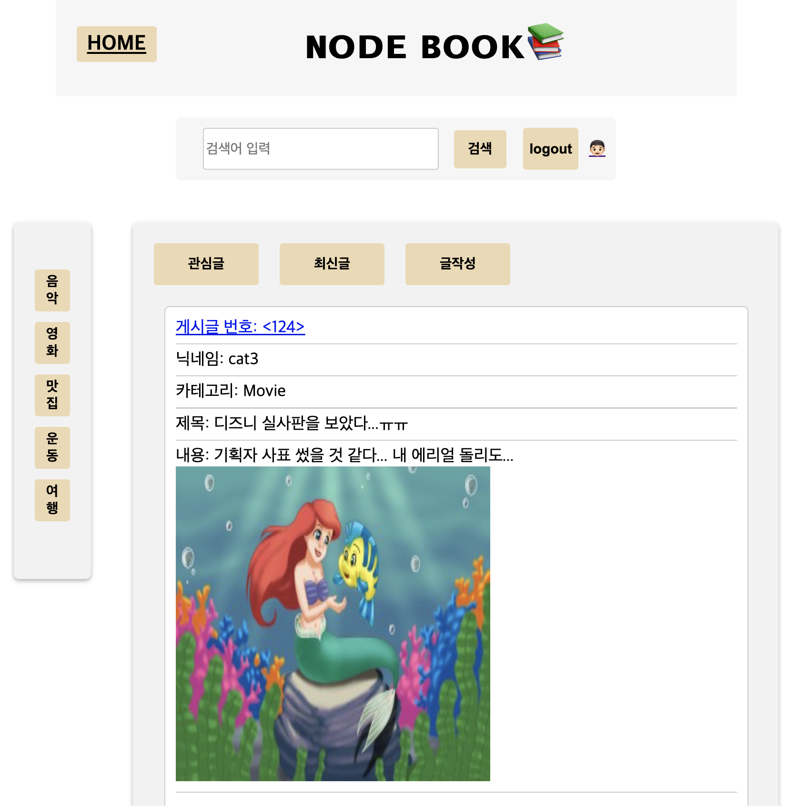
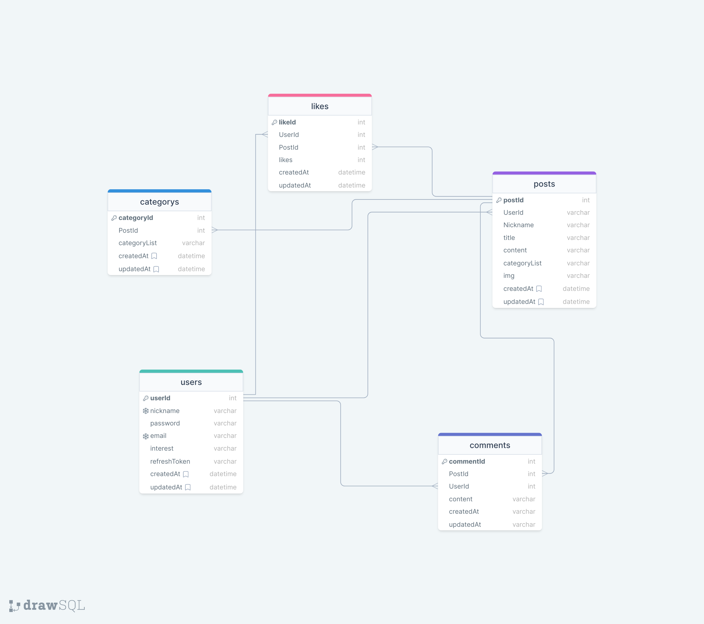

# 📚 NODEBOOK PROJECT

## 개요

> 이 프로젝트는 페이스북, 트위터, 인스타와 같은 뉴스피드 형태의 소셜 미디어를 간소화한 페이지 구현이 목적입니다.  
> 교육 커리큘럼에 따라 node.js 기반 express 프레임워크를 활용하여 뉴스피드 페이지를 구현했습니다.  
> 프로젝트를 진행 과정에서 기존 SNS 페이지를 참조하였으며 기본적인 회원 접속, 뉴스피드 조회, 게시글 작성 관련 기능이 구현되어 있습니다.

## ERD

## API 명세

| Path                               | API Method | Verify | Description                         |
| ---------------------------------- | ---------- | :----: | ----------------------------------- |
| /signup                            | POST       |        | 회원가입                            |
| /signup                            | GET        |        | 회원가입 페이지 이동                |
| /main                              | GET        |        | 메인페이지 이동                     |
| /upload                            | POST       |        | 이미지 업로드                       |
| /login                             | POST       |        | 로그인                              |
| /login                             | GET        |        | 로그인 페이지 이동                  |
| /logout                            | GET        |        | 로그아웃                            |
| /lookup                            | GET        |        | 게시글 검색 기능                    |
| /mypage                            | GET        |        | 마이페이지 이동                     |
| /mypage/userinfo                   | GET        |        | 유저 정보, 게시글 조회              |
| /mypage/nickname                   | PUT        |   ✔    | 유저 닉네임 수정                    |
| /mypage/interest                   | PUT        |   ✔    | 유저 관심사 수정                    |
| /mypage/password                   | PUT        |   ✔    | 유저 패스워드 수정                  |
| /mypage/userfire                   | DELETE     |   ✔    | 유저 탈퇴                           |
| /posts                             | GET        |   ✔    | 게시글 작성 페이지                  |
| /posts                             | POST       |   ✔    | 게시글 작성                         |
| /posts/postId/like                 | GET        |   ✔    | 게시글 좋아요 기능                  |
| /posts/category/interest           | GET        |   ✔    | 유저 관심사 기준 게시글 페이지 이동 |
| /posts/category/:cetegoryId        | GET        |        | 카테고리 기준 게시글 페이지 이동    |
| /posts/detail/:postId              | GET        |   ✔    | 게시글 수정 페이지                  |
| /posts/detail/:postId              | PUT        |   ✔    | 게시글 수정                         |
| /posts/detail/:postId              | DELETE     |   ✔    | 게시글 삭제                         |
| /posts/:postId/comments            | GET        |        | 게시글 내 댓글 조회                 |
| /posts/:postId/comments            | POST       |   ✔    | 게시글 내 댓글 작성                 |
| /posts/:postId/comments/:commentId | PUT        |   ✔    | 댓글 수정(유저 검증)                |
| /posts/:postId/comments/:commentId | DELETE     |   ✔    | 댓글 삭제(유저 검증)                |

[상세 API 명세보기](https://www.notion.so/sh-9403/b6a72ed973014a42ad2959e87230b1c8?v=d704b55762254cc89af3b275219c62b6)

## 팀원 역할 분담

| 이름   | 기능 구현 및 역할                                                                                       |
| ------ | ------------------------------------------------------------------------------------------------------- |
| 심재두 | 좋아요 기능 구현, 좋아요 기능 프론트 구현                                                               |
| 이상훈 | CSS 총괄, 게시글 CRUD, 카테고리, 관심사 별 게시글 조회 기능, S3를 활용한 이미지 업로드, API 프론트 연동 |
| 정희윤 | 코멘트 기능 구현                                                                                        |
| 권윤영 | 마이페이지 기능 구현, 마이페이지 프론트 구현                                                            |
| 박민영 | 회원가입, 로그인, 로그아웃 관련, 인증 미들웨어, API 프론트 연동                                         |

> 📌 `TO DO LIST`
>
> - [x] AWS S3를 이미지 업로드 및 프론트 출력 구현
> - [x] 회원가입, 로그인/로그아웃 페이지 구현
> - [x] 인증 미들웨어 구현 및 로그인 유무 확인 미들웨어 구현
> - [x] 에러 문구 모듈화
> - [x] 유저별 관심사 등록 및 관심사 기준 게시글 조회 기능 구현
> - [x] 게시글에 카테고리 지정 및 조회 기능 구현
> - [x] 게시글에 좋아요 기능 추가 및 취소 기능 구현
> - [x] 게시글 좋아요 갯수 카운팅 구현
> - [x] 게시글 검색 기능 구현 (타이틀, 내용, 닉네임 기준 키워드 검색)
> - [x] 게시글 및 댓글 작성 CRUD 기능 구현
> - [x] 마이페이지 CRUD 구현 (닉네임, 관심사, 패스워드 수정 및 회원 탈퇴)
> - [x] bcrypt를 적용하여 비밀번호 해시 적용

---

## 여러웠던 점

### (공통) EJS 파일 사용 관련 어려움

- 백엔드에서 응답 받은 결과를 EJS 파일에 출력하는 과정에서 문법이 익숙하지 어려움이 있었다.
- 기존 프론트 구현 방식처럼 HTML에 javascript를 연동시켜서 페이지에 출력하는 방식과 EJS에 직접 백엔드 결과를 전달하는 방식을 모두 사용하게 되어 해당 부분에서 기능 구현이 다소 비효율적이게 된 것 같다.

### 추가 기능 구현에서의 어려움

- 업로드 된 이미지를 프론트에 출력하는 과정에서 이미지 사이즈가 일관성을 유지하도록 하기 위한 과정에서 어려움이 있었음
- 일관된 이미지 사이즈 출력 구현을 위해 리사이징을 시도하는 과정에서 sharp 패키지 사용을 시도했으나 input 관련 에러가 발생해서 구현에 한계에 부딪힘
- 이미지 리사이징 관련하여 AWS Lambda 사용까지 고려하였으나 프로젝트 기간을 고려하여 제외함
- 키워드 검색 시 하이라이팅 기능을 구현해보려 했으나 프로젝트 기간을 고려하여 제외함
- 기존 닉네임, 관심사 수정에서는 prompt 메서드를 사용하여 수정값을 input 받았으나 유저 패스워드 수정 구현 시 기존/변경 패스워드 이렇게 총 2가지의 값을 한번에 input 해야 되다보니 하나의 prompt 사용에 제한이 있었고, 이를 해결하기 위해 순차적으로 prompt 메서드 기능이 구현되도록 함
- passport 패키지를 사용하여 카카오 계정 로그인 구현을 시도했으나 기존에 사용하던 인증 미들웨어를 전면 수정해야 하는 상황이어서 기능 적용을 생략하였습니다.

## 마무리 및 총평

- 프론트 구현 과정에서 익숙하지 않았던 EJS를 활용에 상당 부분 시간을 할애하게 되었고, 이로 인해 백엔드 추가 기능 구현에 시간을 투자할 수 없었던 점이 아쉬웠던 것 같습니다.
- 프론트와 백엔드를 연결하는 과정에서의 work flow에 좀 더 익숙하게 되었던 것 같습니다.
- 백엔드로만 구현했던 기능을 프론트에서 직접 동작하도록 버튼 생성 및 이벤트리스너 등록과 같은 기능 구현에 익숙해질 수 있었던 시간이었습니다.
- 새로운 기능 추가 및 디버깅 과정에서 해결 방안을 탐색하는 과정이 향상된 것 같습니다.
- 팀원과 함께 디버깅을 하는 과정에서 각자의 디버깅 관점을 공유할 수 있어서 좋았습니다.
